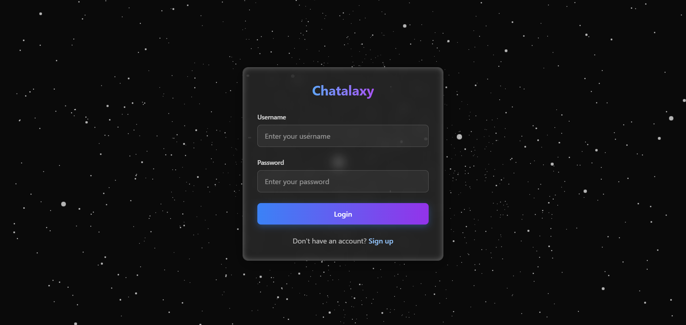
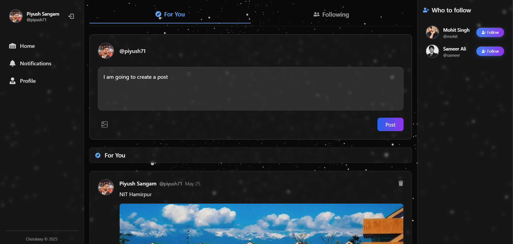

# 🌌 Chatalaxy – A Modern MERN Social Media Platform

**Live Demo → [chatalaxy.onrender.com](https://chatalaxy.onrender.com/)**

Chatalaxy is a dynamic, full-stack social media application built with the **MERN** stack. It delivers a seamless and real-time experience where users can share posts, engage with others, manage profiles, and enjoy an immersive UI powered by 3D libraries like `react-three/fiber`.

---

## ✨ Key Features

- 🔐 **JWT Authentication & Authorization**
- 📝 **Create, Like, and Delete Posts**
- 💬 **Comment System** – Interact in real time
- 👥 **Follow / Unfollow Users**
- 🔔 **Real-Time Notifications**
- ❌ **Delete Notifications**
- 🧑‍💻 **Edit & Update Profile**
- 🌐 **Responsive Design** – Fully optimized for mobile and desktop
- 🧠 **3D-Enhanced UI** – Built using `react-three/fiber` & `three.js`

---

## 🎯 Project Motivation

> In today’s digital age, Chatalaxy was created to offer a minimalist yet powerful alternative to traditional social platforms. The goal was to blend **real-time interactivity**, **modern design**, and **cutting-edge technologies** to deliver a rich user experience — all while learning and applying full-stack development skills.

---

## 🛠️ Tech Stack

### 🖥️ Frontend
- **React 18**, **React Router v7**
- **Tailwind CSS** for utility-first styling
- **@tanstack/react-query** – Server state management
- **react-hot-toast** – Elegant toast notifications
- **@react-three/fiber**, **three.js** – 3D rendering
- **lucide-react**, **radix-ui** – Icons & accessible UI primitives

### 🌐 Backend
- **Node.js + Express.js**
- **MongoDB** with **Mongoose** ORM
- **JWT** – Secure token-based auth
- **Cloudinary** – Media storage and optimization
- **bcryptjs** – Password hashing
- **dotenv**, **cookie-parser** – Environment and session handling

---

## 📸 Screenshots




---

## 🚀 Getting Started

```bash
# 1. Clone the repository
git clone https://github.com/yourusername/chatalaxy.git
cd chatalaxy

# 2. Install dependencies
npm install

# 3. Add environment variables
cp .env.example .env

# 4. Start the development server
npm run dev
